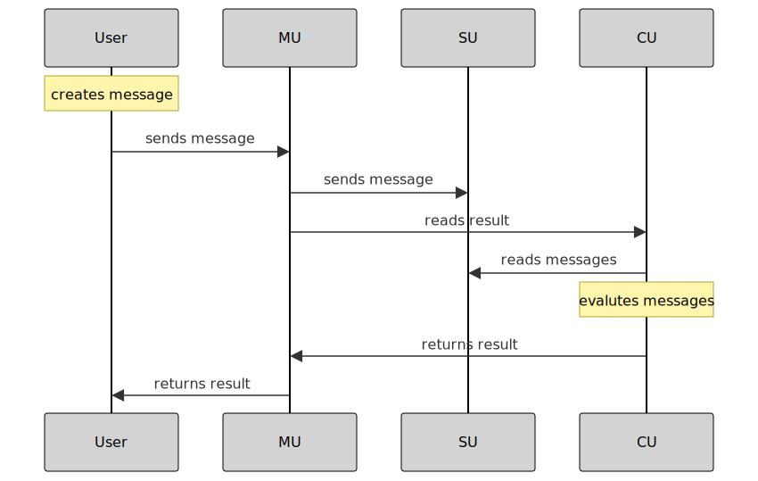
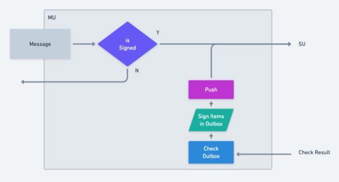
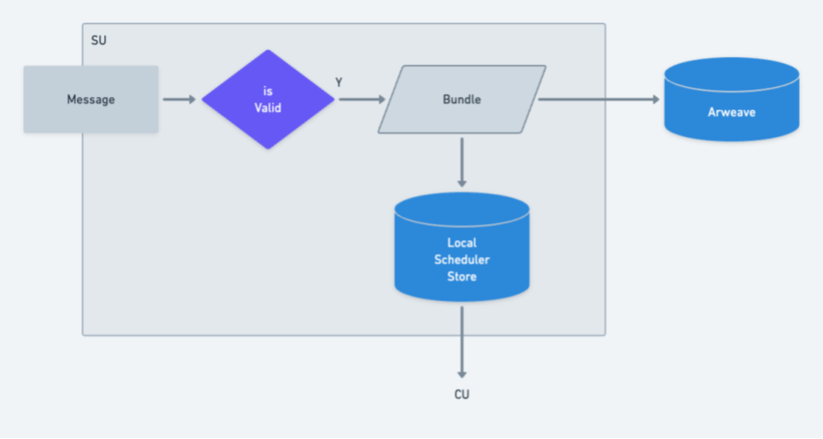
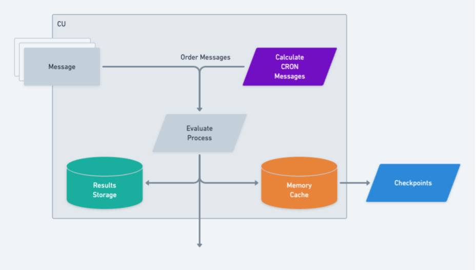
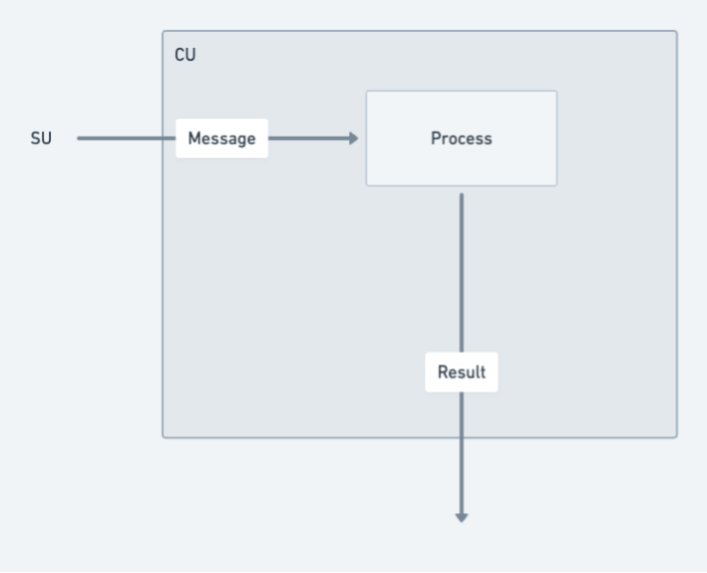

## AO 简介

### 介绍

ao 计算机是一个单一的、统一的计算环境（单系统映像），运行在 Arweave 网络上。 ao 旨在提供一个环境，其中可以驻留任意数量的并行进程，并通过开放的消息传递层进行协调。 这种消息传递标准将机器的独立运行进程连接到一个 "网络" 中，就像网站在独立服务器上运行但通过超链接连接成一个有凝聚力的统一整体。

### 相关概念

> + 消息（message）: 消息作为 ao 网络的主要数据协议类型，利用 Arweave 原生的 ANS-104 数据项。消息包含多个字段，包括数据内容、来源、目标以及签名和随机数等加密元素。
> + 进程（process）: 运行的代码片段，网络中的进程通过消息传递进行通信，并且可以创建新进程，从而形成共享和持久数据的 "全息状态"。
> + AOS: AOS 控制台是 AOS 模块的交互式 shell，此 shell 的目的是为开发人员提供有趣且引人入胜的 AOS 操作系统模块以及用户体验。用户应该喜欢运行他们的个人流程并在网络上参与，从交易到聊天，再到游戏。因此，控制台应该易于安装在所有主要操作系统平台上。
> + aoconnect: aoconnect 库提供了用于生成、评估和与 ao 进程交互的抽象。(npm package)
> + 单元（unit）: 为ao网络提供各种服务的单元模块，包括消息传递、调度、计算等。
>   + MU（Messenger Unit）: 该单元是 ao 的前门，它接收来自外部的所有消息并按序引导给进程。每个进程在处理消息时可以返回一个发件箱，这个发件箱可以填充消息或生成新进程的请求，信使单元负责从发件箱中提取这些消息并签名后将它们发送到调度单元进行加工。
>   + SU（Scheduler Unit）: 调度单元负责对消息进行排序，并将这些消息存储在 Arweave 上。 重要的是，每条消息都必须适当排序，以便求值过程可以被重现和验证。 调度单元负责这整个过程。 它提供了通过端点查询的能力，以获得用于求值的消息的顺序。
>   + CU（Compute Unit）: 计算单元负责计算，该单元加载二进制模块并管理该模块的内存，以便进程的执行始终在最新的内存上运行。 计算单元将求值结果返回给信使单元，然后信使单元可以将任何消息推送到给定进程的发件箱中。

总结 : cu负责计算，mu负责消息传递，su负责调度。cu提供进程的运行环境，mu负责消息传递给指定进程，su负责对消息进行排序，将消息存储在arweave上。

----

### 流程图



具体描述：

1. 一条消息从 ao Connect 被发出。 该消息使用 POST 请求发送到 mu 服务。 请求正文包含遵循同一协议的数据，标记为 ao，类型为 Message。
2. mu 服务处理 POST 请求并将消息转发到 su 服务。 这也是使用具有相同数据协议和消息类型的 POST 请求来完成的。
3. su 服务似乎与存储消息的称为 Arweave 的存储或数据层进行交互。
4. 向 cu 服务发出 GET 请求，以根据消息 ID 检索结果。 cu 是一种进程上的对消息求值并可以根据单个消息标识符返回结果的服务。
5. 向 su 服务发出 GET 请求以检索消息。 此请求查找来自某个进程 ID 的开始结束时间范围是 from到 to 的消息。
6. 最后一步是推送所有发件箱消息。 它涉及检查结果对象中的消息和新进程生成请求。 根据此检查的结果，可以对每个相关消息或新进程生成请求重复步骤 2、3 和 4。

## 模块详解

### AOS 客户端

#### 安装

> npm i -g <https://get_ao.g8way.io>

#### 创建进程

> aos

aos 命令运行时，其实是你在使用密钥文件向 aos 验证你的身份的。如果没有指定，aos 会默认生成一个新的密钥文件并将其存储在本地 ~/.aos.json。如果你有 Arweave 钱包，可以使用 --wallet [location] 参数使用指定钱包。

该命令操作实际上是使用arweave钱包向arweave网络发送存储交易，并在tags中存储该进程有关信息
如 :
> { name: 'App-Name', value: 'aos' },{ name: 'Name', value: name },{ name: 'Authority', value: 'fcoN_xJeisVsPXA-trzVAuIiqO3ydLQxM-L4XbrQKzY' },    { name: 'Data-Protocol', value: 'ao' },{ name: 'Variant', value: 'ao.TN.1' },{ name: 'Type', value: 'Process' },{ name: 'Module', value: ctx.module },{ name: 'Scheduler', value: ctx.scheduler },{ name: 'SDK', value: 'aoconnect' }

使用钱包签名交易体时会生成交易id, 该id一个是唯一标识，用于标识该进程（processid）

注：aos启动时，会指定mu、cu的url,以及arweave网关来进行模块串联

```js
  process.env.GATEWAY_URL ||= 'https://arweave.net'
  process.env.CU_URL      ||= 'https://cu.ao-testnet.xyz'
  process.env.MU_URL      ||= 'https://mu.ao-testnet.xyz'
```

例：<https://arweave.app/tx/O31giSDfPd_ZtvmHQBYL0-pK8d4p5LDXdjAMWWn4tlk>

----

#### 部署合约（加载lua代码）

执行.load-buleprint命令，加载客户端中已有lua模版（蓝图），发送交易至arweave，将lua代码存储在arweave上
> .load-buleprint token

或执行.load命令，加载本地lua代码，发送交易至arweave，将lua代码存储在arweave上
> .load ~/workspace/token.lua

例：<https://arweave.app/tx/KXynPjuTU5DVGPCbVJPMI6xXZ_5r-9SzH_Gx488NvMo>

#### 合约交互

在启动客户端后输入命令，可以与合约进行交互
> Send({ Target = ao.id, Tags = { Action = "Transfer", Recipient = 'another wallet or processid', Quantity = '10000' }})

send命令是向指定进程发送交易，交易中包含了对应操作的tags

例：<https://arweave.app/tx/m-KVTcxZ_k69xf8PueI5LxpUTkyP-WH3NunjUEZzep4>

### AO 单元

#### MU 单元（Messenger Unit）

根据aos或者aoconnect的请求，mu单元会接收到消息，然后将消息进行签名，最后将消息发送到su单元进行排序。



### SU 单元（Scheduler Unit）

调度单元 - 调度单元负责对消息进行排序，并将这些消息存储在 Arweave 上



### CU 单元（Compute Unit）

从arweave上加载进程到内存中，并在交互过程中更新进程状态，并将运行结果返回至mu单元



### aoconnect 库

aoconnect 库提供了用于生成、评估和与 ao 进程交互的抽象。

实例化进程

```js

import { connect } from "@permaweb/aoconnect";

const { result, results, message, spawn, monitor, unmonitor, dryrun } = connect(
  {
    MU_URL: "https://mu.ao-testnet.xyz",
    CU_URL: "https://cu.ao-testnet.xyz",
    GATEWAY_URL: "https://arweave.net",
  },
);

```

此时会在cu单元中实例化一个进程。该进程在cu单元的内存中运行，可以通过message、dryrun函数与其进行交互。

dryrun

```js
const result = await dryrun({
  process: 'PROCESSID',
  data: '',
  tags: [{name: 'Action', value: 'Balance'}],
  anchor: '1234',
  ...rest are optional (Id, Owner, etc)
});

console.log(result.Messages[0]);
```

message

```js
  const messageId = await message({
    process: "O31giSDfPd_ZtvmHQBYL0-pK8d4p5LDXdjAMWWn4tlk",
    data: "",
    signer,
    tags: [
      { name: "Action", value: "Mint" },
      { name: "Quantity", value: "1000" },
    ],
  });
```

result

```js
  const _result = await result({
    process: "O31giSDfPd_ZtvmHQBYL0-pK8d4p5LDXdjAMWWn4tlk",
    message: messageId,
  });
```

aos集成了aoconnect库，也是通过aoconnect库与ao网络进行交互

---

## 概念补充

#### 消息 (message)

消息作为 ao 中的基本数据协议单元，依据 ANS-104 DataItems 制作而成，从而与 Arweave 的原生结构保持一致。 当消息体进入进程时，其结构如下：

```js
{
    Cron = false,
    Data = "Hello aos",
    Epoch = 0,
    From = "5WzR7rJCuqCKEq02WUPhTjwnzllLjGu6SA7qhYpcKRs",
    Id = "ayVo53qvZswpvxLlhMf8xmGjwxN0LGuHzzQpTLT0_do",
    Nonce = 1,
    Owner = "z1pq2WzmaYnfDwvEFgUZBj48anUsxxN64ZjbWOsIn08",
    Signature = "...",
    Tags = {
        Type = "Message",
        Variant = "ao.TN.1",
        ["Data-Protocol"] = "ao",
        ["From-Module"] = "lXfdCypsU3BpYTWvupgTioLoZAEOZL2_Ihcqepz6RiQ",
        ["From-Process"] = "5WzR7rJCuqCKEq02WUPhTjwnzllLjGu6SA7qhYpcKRs"
    },
    Target = "5WzR7rJCuqCKEq02WUPhTjwnzllLjGu6SA7qhYpcKRs",
    Timestamp = 1704936415711,
    ["Block-Height"] = 1340762,
    ["Forwarded-By"] = "z1pq2WzmaYnfDwvEFgUZBj48anUsxxN64ZjbWOsIn08",
    ["Hash-Chain"] = "hJ0B-0yxKxeL3IIfaIIF7Yr6bFLG2vQayaF8G0EpjbY"
}
```

消息作为 ao 网络的主要数据协议类型，利用 Arweave 原生的 ANS-104 数据项。消息包含多个字段，包括数据内容、来源、目标以及签名和随机数等加密元素。 接着他们被发给信使单元 (MU) ，以确保它们经过签名，通过调度器单元 (SU) 对它们进行时间戳和排序，然后捆绑并发布到 Arweave。 然后，aoconnect 库从计算单元 (CU) 读取结果，CU 通过处理消息来计算出结果后通过 aoconnect 发回响应，供 aos 等客户端使用。

#### 进程（process）

进程之间具有通过消息传递进行通信的能力，包括在网络内接收和发送消息。 此外，它们还具有实例化更多进程的潜力，从而增强网络的计算结构。这种网络内数据传播和交互的动态方法被称为 全息状态，支撑网络状态的共享和持久化。



当使用 aos 构建进程时，你可以添加处理程序(handlers)，可以通过调用 Handlers.add 函数并传递 “name”、“match”函数和“handle”函数来添加这些处理程序。(总结为运行的代码片段)

### checkPoint

进程状态一直由交易arweave交易改变，需要引入checkPoint，checkPoint是进程的一个快照，可以用来恢复进程状态。

在cu模块关闭或到达配置的间隔条件时，cu会先arweave发送checkPoint交易，来保存当前进程的状态。

```js
  tags: [
      { name: 'Data-Protocol', value: 'ao' },
      { name: 'Variant', value: 'ao.TN.1' },
      { name: 'Type', value: 'Checkpoint' },
      { name: 'Module', value: moduleId.trim() },
      { name: 'Process', value: processId.trim() },
      /**
       * Cron messages will not have a nonce but WILL
       * have an ordinate equal to the most recent nonce
       * (which is to say the nonce of the most recent Scheduled message)
       */
      { name: 'Nonce', value: `${nonce || ordinate}`.trim() },
      { name: 'Timestamp', value: `${timestamp}`.trim() },
      { name: 'Block-Height', value: `${blockHeight}`.trim() },
      { name: 'Content-Type', value: 'application/octet-stream' },
      { name: 'SHA-256', value: sha },
      /**
       * We will always upload Checkpoints to Arweave as
       * gzipped encoded (see below)
       */
      { name: 'Content-Encoding', value: 'gzip' }
    ]
```

### 总结

ao是使用mu、su、cu三个单元模块配合arweave存储来实现的一个分布式计算网络。每个单元都启动一个服务，通过http请求来进行模块间的通信。整个架构非常解耦，每个单元都可以独立部署，方便扩展和维护。用户使用aoconnect库来与ao网络进行交互，可以灵活的选择cu、mu来实例化一个进程，然后通过send命令来与其他进程进行交互。

### 发展阶段

Preview -> Early -> Complete

当前处于Preview阶段

### 参考

<https://cookbook_ao.g8way.io/zh/welcome/index.html>

<https://github.com/permaweb/ao/blob/main/README.md>

<https://github.com/permaweb/aos/blob/main/README.md>
